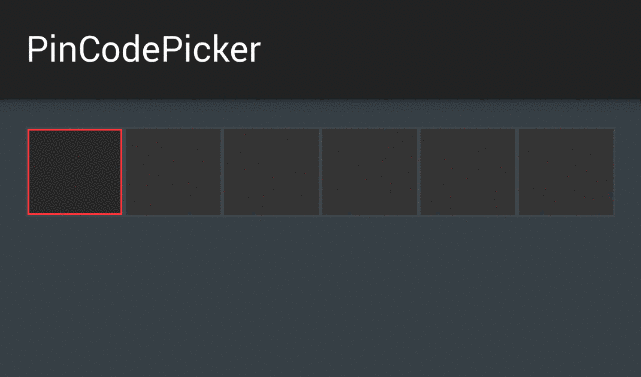

#PinCodePicker

###Version: 0.0.1

[](https://www.apache.org/licenses/LICENSE-2.0)

###Description

PinCodePicker was created for Android platform as a view which allows to take passwords/codes or some other sensitive data from end user in easy way, so developers can focus on the core functionalities of their application!

Notice that PinCodePicker is a project under huge development ;) (at least should be)

####Welcome to fork and pull request.

###Screenshot


###Quick Setup（Basic Usage)

#####1.Integration

###### Using Gradle:

```groovy
dependencies {
    compile 'com.github.polok.pincodepicker:pincodepicker:0.0.1'
}
```

###### Using Maven:

```xml
<dependency>
    <groupId>com.github.polok.pincodepicker</groupId>
    <artifactId>pincodepicker</artifactId>
    <version>0.0.1</version>
</dependency>
```

#####2.Usage

######Add picker into our UI (set pincode length)
```xml
    <com.github.polok.pincodepicker.PinCodeRecyclerView
        android:id="@+id/list"
        android:layout_width="match_parent"
        android:layout_height="wrap_content"
        android:layout_centerHorizontal="true"
        android:background="#3E464C"
        pin_code:pin_code_length="6"/>
```

######Set listener to be notified when whole pin code was entered

```java
    PinCodeRecyclerView view = (PinCodeRecyclerView) findViewById(R.id.list);
        view.setPincodeListener(new PinCodeListener() {
            @Override
            public void onPinCodeInserted(String pinCode) {
                Toast.makeText(MainActivity.this, "Whole code", Toast.LENGTH_SHORT).show();
            }
        });
```

####If you want to see more details, go ahead and check the demo!

License
--------

    Copyright 2015 Marcin Polak

    Licensed under the Apache License, Version 2.0 (the "License");
    you may not use this file except in compliance with the License.
    You may obtain a copy of the License at

       http://www.apache.org/licenses/LICENSE-2.0

    Unless required by applicable law or agreed to in writing, software
    distributed under the License is distributed on an "AS IS" BASIS,
    WITHOUT WARRANTIES OR CONDITIONS OF ANY KIND, either express or implied.
    See the License for the specific language governing permissions and
    limitations under the License.

